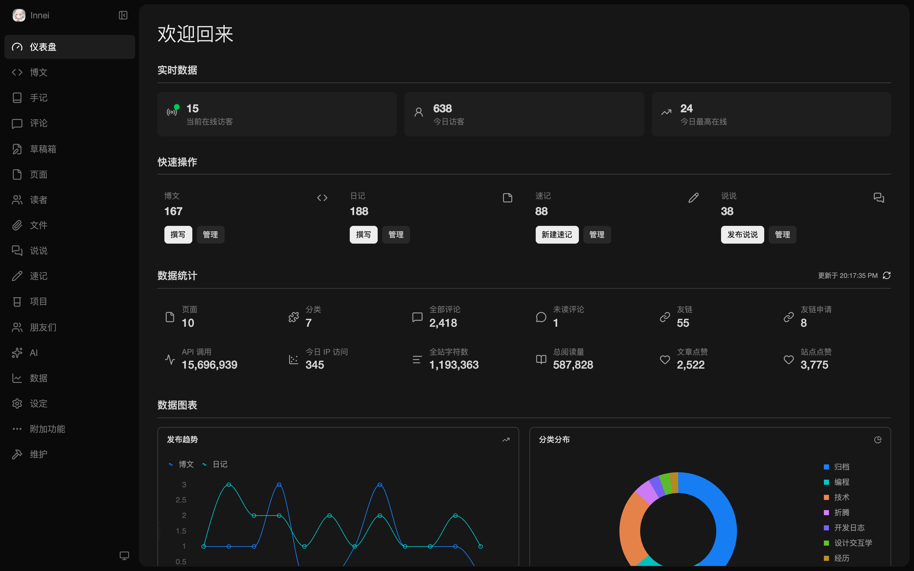
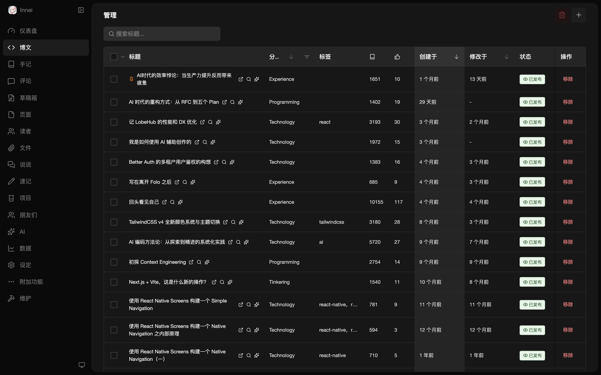
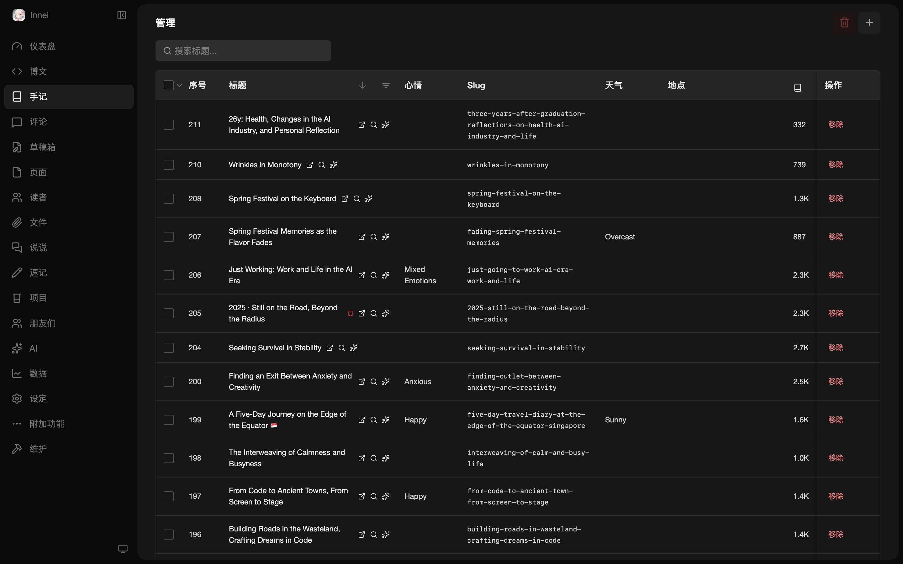
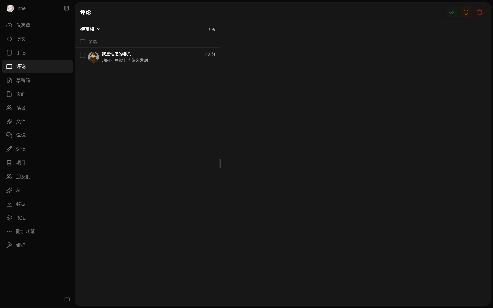
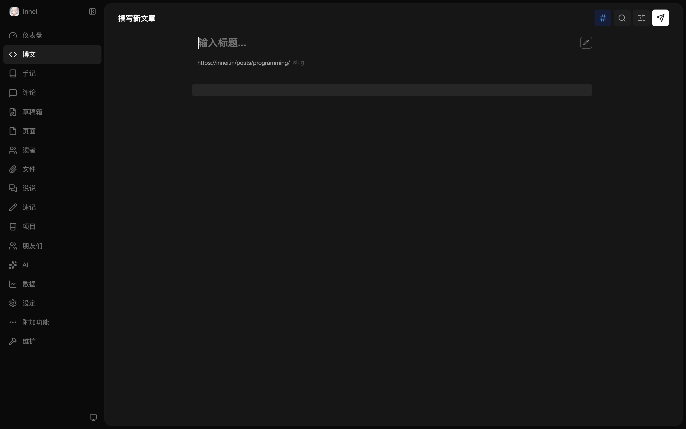
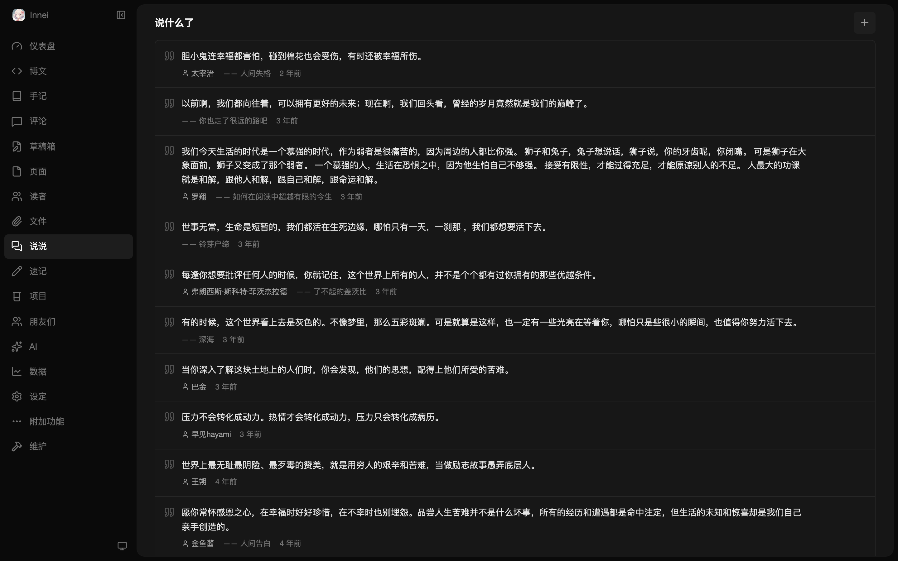
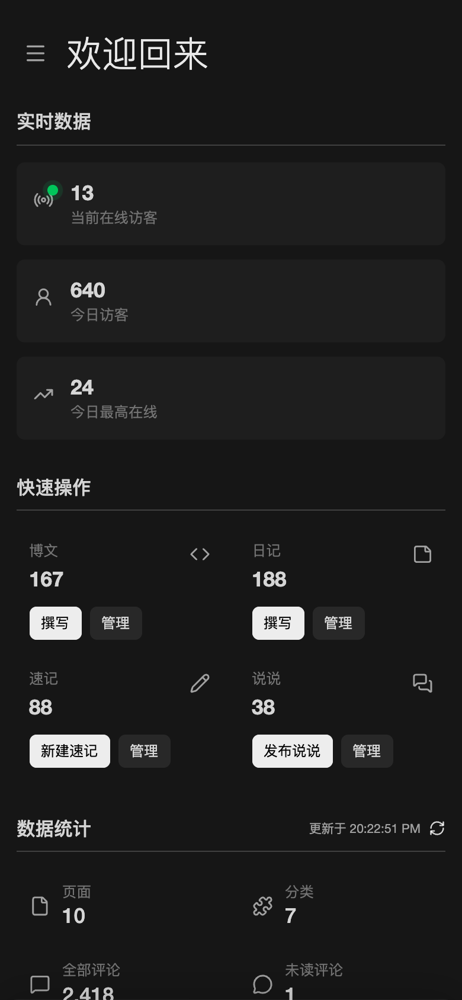

# MX Space Admin

The dashboard for [MX Space](https://github.com/mx-space), a personal space management system. Built with **Vue 3**, **Naive UI**, and **UnoCSS**.

> v4.0 for Mix Space Server v5.0

## Preview

### Desktop

| Dashboard | Posts |
|-----------|-------|
|  |  |

| Notes | Comments |
|-------|----------|
|  |  |

| Post Editor | Settings |
|-------------|----------|
|  |  |

| Says | AI |
|------|-----|
|  |  |

### Mobile

<p float="left">
  
  
  
</p>

## Features

- Real-time dashboard with live visitor stats, content analytics, and trend charts
- Full content management: posts, notes, pages, drafts, comments, says
- Rich text editor with AI-assisted writing
- AI-powered content summarization and translation
- File management with orphan image detection
- Friend links and project showcase management
- Responsive design with mobile support
- Dark mode with Vercel-style neutral theme
- WebSocket-based real-time updates

## Getting Started

```bash
git clone https://github.com/mx-space/mx-admin.git
pnpm install
pnpm dev
```

## Build

```bash
pnpm build
```

## Tech Stack

- [Vue 3](https://vuejs.org/) + Composition API + TSX
- [Naive UI](https://www.naiveui.com/) - Component library
- [UnoCSS](https://unocss.dev/) - Atomic CSS engine
- [TanStack Query](https://tanstack.com/query) - Server state management
- [Pinia](https://pinia.vuejs.org/) - Store management
- [CodeMirror](https://codemirror.net/) / [Monaco Editor](https://microsoft.github.io/monaco-editor/) - Code editors
- [Socket.IO](https://socket.io/) - Real-time communication

## License

MIT. © 2021-present Mix Space & Innei
