# MX Space Admin

The dashboard for [MX Space](https://github.com/mx-space), a personal space management system. Built with **React**, **Base UI**, and **UnoCSS**.

> v4.0 for Mix Space Server v5.0

## Preview

### Desktop

| Dashboard | Posts |
|-----------|-------|
| 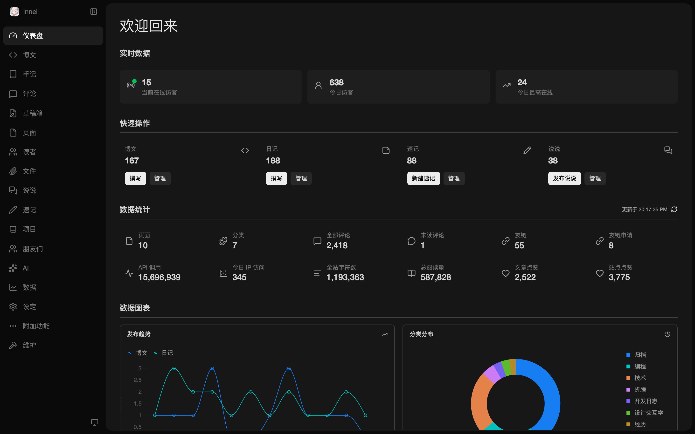 | 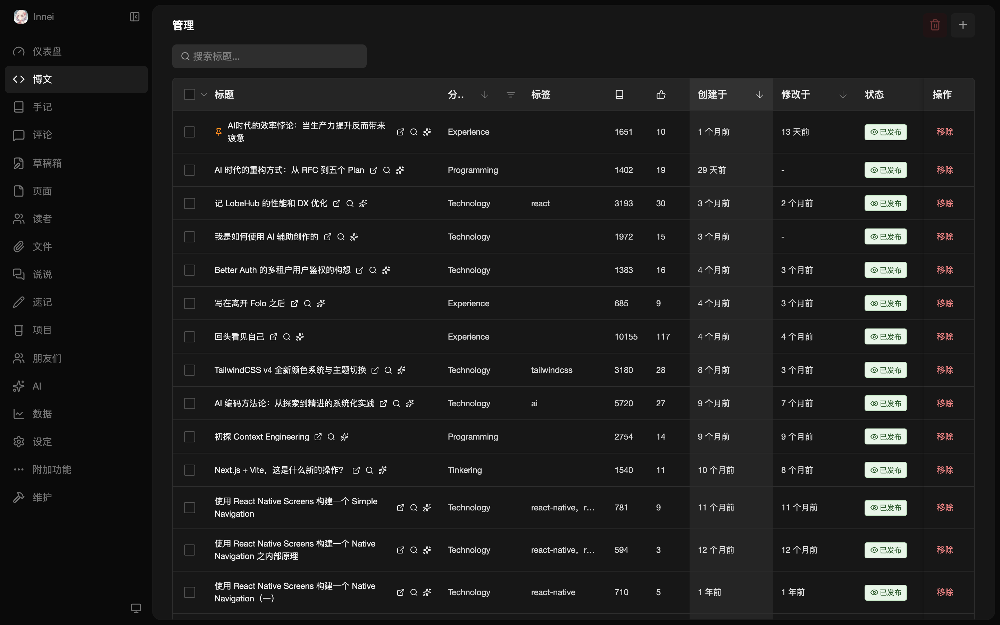 |

| Notes | Comments |
|-------|----------|
| 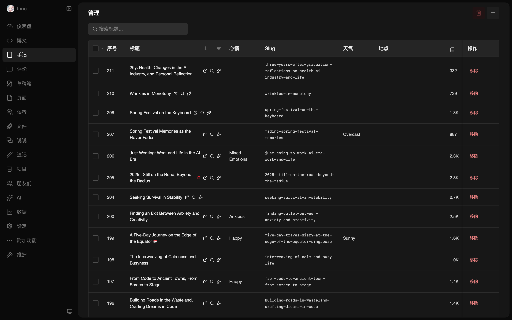 | 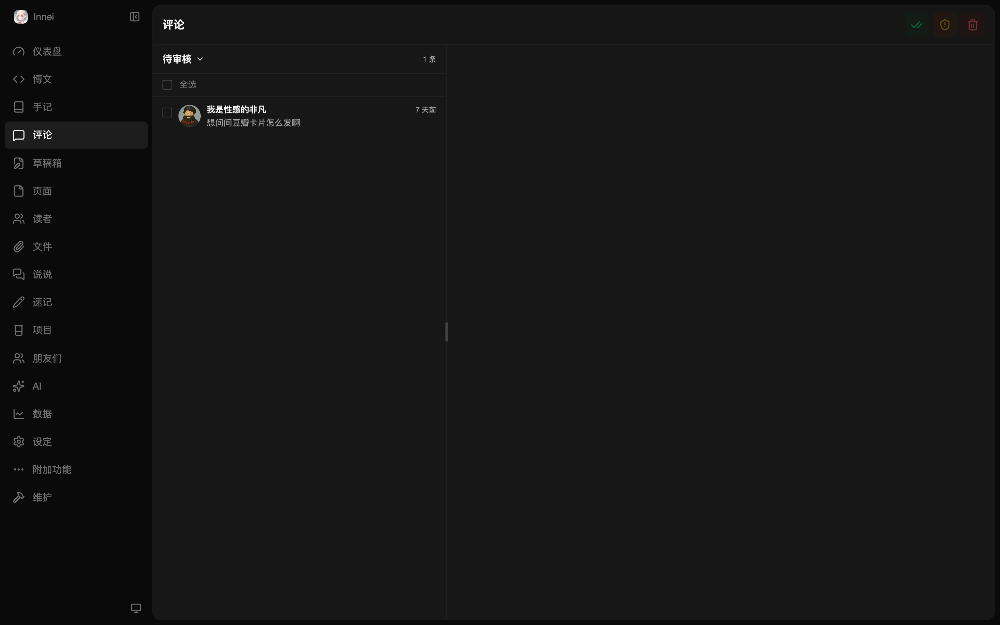 |

| Post Editor | Settings |
|-------------|----------|
| 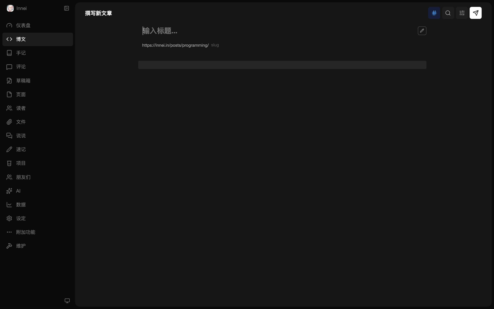 | 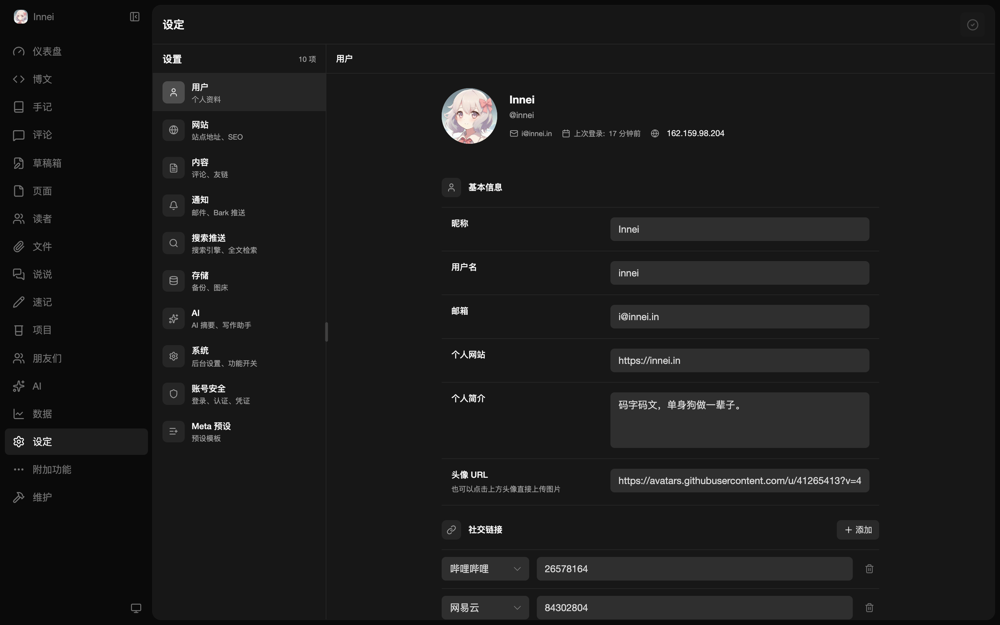 |

| Says | AI |
|------|-----|
| 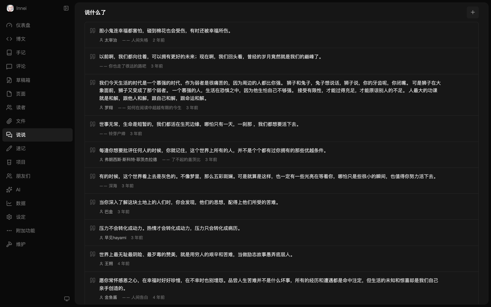 | 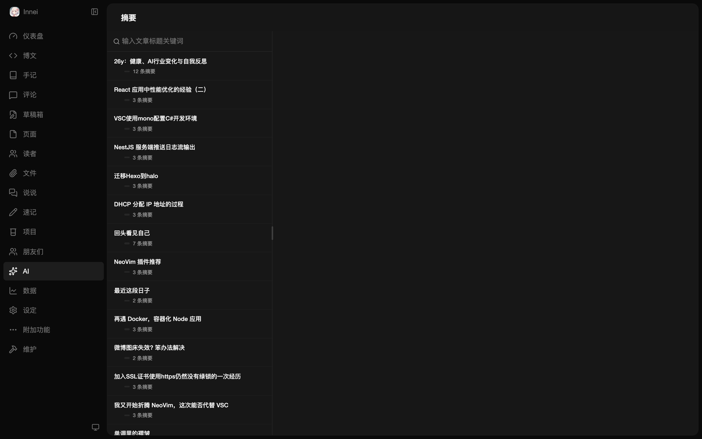 |

### Mobile

<p float="left">
  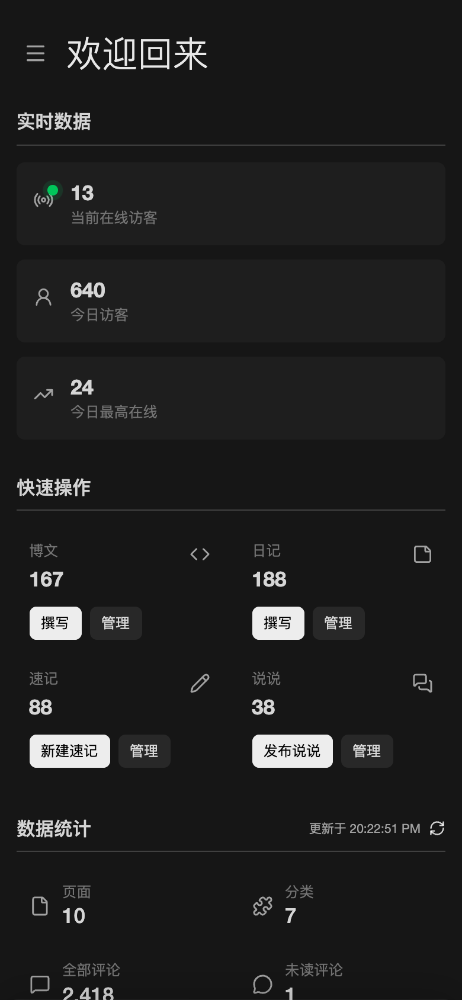
  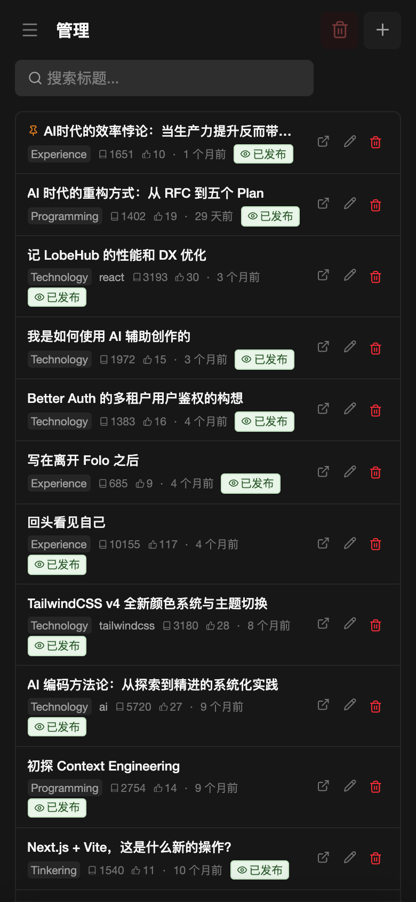
  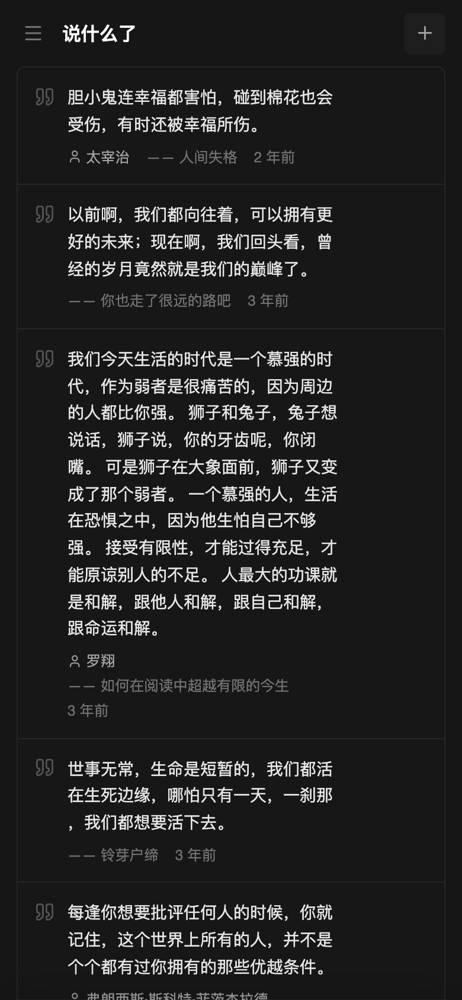
</p>

## Features

- React Router application shell with Base UI primitives
- Content and operations surfaces for comments, says, projects, friends, subscribers, webhooks, backups, cron tasks, search index, and markdown import/export
- Authentication and setup flows
- Debug labs for toast, passkey, socket event, and serverless function diagnostics
- Dark mode with Vercel-style neutral theme

## Getting Started

```bash
git clone https://github.com/mx-space/mx-admin.git
pnpm install
pnpm dev
```

## Build

```bash
pnpm build
```

## Tech Stack

- [React](https://react.dev/) + TSX
- [Base UI](https://base-ui.com/) - Headless component primitives
- [React Router](https://reactrouter.com/) - Routing
- [UnoCSS](https://unocss.dev/) - Atomic CSS engine
- [TanStack Query](https://tanstack.com/query) - Server state management
- [Sonner](https://sonner.emilkowal.ski/) - Toast notifications
- [Socket.IO](https://socket.io/) - Real-time communication

## License

MIT. © 2021-present Mix Space & Innei
